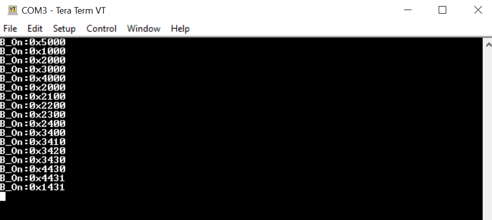

# ATTINY3217 Touch Demo

> "IoT Made Easy!"

Devices: **| ATTINY3217 Xplained Pro | T10 Xplained Pro |** 
Features: **| TOUCH |**

## ⚠ Disclaimer

<b>
THE SOFTWARE ARE PROVIDED "AS IS" AND GIVE A PATH FOR SELF-SUPPORT AND SELF-MAINTENANCE. This repository contains example code intended to help accelerate client product development.  

For additional Microchip repos, see: <a href="https://github.com/Microchip-MPLAB-Harmony" target="_blank">https://github.com/Microchip-MPLAB-Harmony</a>

Checkout the <a href="https://microchipsupport.force.com/s/" target="_blank">Technical support portal</a> to access our knowledge base, community forums or submit support ticket requests.

</b>

## Contents

1. [Bill of materials](#step1)
1. [Hardware Setup](#step2)
1. [Software Setup](#step3)
1. [Atmel Start Configuration](#step4)
1. [Board Programming](#step5)
1. [Run the demo](#step6)

## 1. Bill of materials<a name="step1">

- [ATtiny3217 Xplained Pro](https://www.microchip.com/en-us/development-tool/ATTINY3217-XPRO)
- [T10 Xplained Pro Extension Kit](https://www.microchip.com/en-us/development-tool/AC47H23A)

## 2. Hardware Setup<a name="step2">

- Connect T10 Xplained Pro Extension header 3 (EXT3) to ATtiny3217 Xplained Pro kit Extension Header 1 (EXT1).

## 3. Software Setup<a name="step3">

- [Microchip Studio](https://www.microchip.com/en-us/tools-resources/develop/microchip-studio#Downloads)

- Any Serial Terminal application like [TERA TERM](https://download.cnet.com/Tera-Term/3000-2094_4-75766675.html) terminal application

- [MPLAB X IPE](https://microchipdeveloper.com/ipe:installation)

## 4. Atmel Start Configuration<a name="step4">

### Getting started with touch application in ATTINY3217 XPRO

**Step 1** - Connect the ATtiny3217 Xplained Pro and T10 Xplained Pro interface to the device/system using a micro-USB cable.

**Step 2** - Create a new Atmel start project on Microchip Studio.

**Step 3** - From the middleware section add QTouch Library.

**Step 4** - From the drivers section add the following peripheral modules by changing the value from 0 to 1.

- I2C
- Timer
- PTC
- USART

**Step 5** - Select ATtiny3217 Xplained Pro board and then select create new project.

**Step 6** - Change the USART configurations as shown below.

**Step 7** - Change the I2C configurations as shown below.

**Step 8** - In the QTouch configurator select the sensor and pin configurations for button and slider as shown below.

- In Pin section, enable table view.

- Select the pin configuration as shown below.

**Step 9** - Select generate project button. In the solution explorer you will find the generated project.

**Step 10** - Add the "led_driver.c" and "led_driver.h" files to your project by following the steps mentioned below. 

- The files can be found by navigating to the following path: "PIC32CXBZ2_WBZ45x_BLE_SENSOR_Touch_ATtiny3217\ATTiny3217_T10\ATTiny3217_T10"
- Copy the files to the project folder.
- Right click on the project in Solution explorer.
- Select Add->Existing item.
- Select the file and click add.

**Step 11** - Replace the "main.c" and "atmel_start.h" files.

- The files can be found by navigating to the following path: "PIC32CXBZ2_WBZ45x_BLE_SENSOR_Touch_ATtiny3217\ATTiny3217_T10\ATTiny3217_T10"

**Step 12** - In the projects section, go to qtouch->touch.h and change the DEF_TOUCH_DATA_STREAMER_ENABLE value to 0u.

- #define DEF_TOUCH_DATA_STREAMER_ENABLE 0u

**Step 13** - Rebuild and run the application. The logic implemented in ATtiny3217 is shown in the video below.

**Step 14** - The transmitted data can be seen in the Tools->Data Visualizer or in Tera term by making the follwing settings.

- Baud rate: 38400
- Com port: EDBG virtual COM port

#### Application Flowchart

## 5. Board Programming<a name="step5">

### Program the precompiled hex file using MPLAB X IPE

- The application hex files can be found by navigating to the following paths:"PIC32CXBZ2_WBZ45x_BLE_SENSOR_Touch_ATtiny3217/hex/ATTINY3217_T10.hex"
- Follow the steps in the link to [program the precompiled hex file](https://microchipdeveloper.com/ipe:programming-device) using MPLABX IPE to program the pre-compiled hex image. 

### Build and program the application using Microchip Studio

- The application folder can be found by navigating to the following path: "PIC32CXBZ2_WBZ45x_BLE_SENSOR_Touch_ATtiny3217/ATTINY3217_T10"
- Build the solution by clicking the "Build Solution" button.
- Run the solution by clicking the "Start without debugging" button.

## 6. Run the demo<a name="step6">

- After programming the board the expected application behavior is shown in the below [video](https://github.com/MicrochipTech/PIC32CXBZ2_WBZ45x_BLE_SENSOR_Touch_ATtiny3217/blob/main/ATTiny3217_T10/docs/ATTINY3217_T10.gif).

