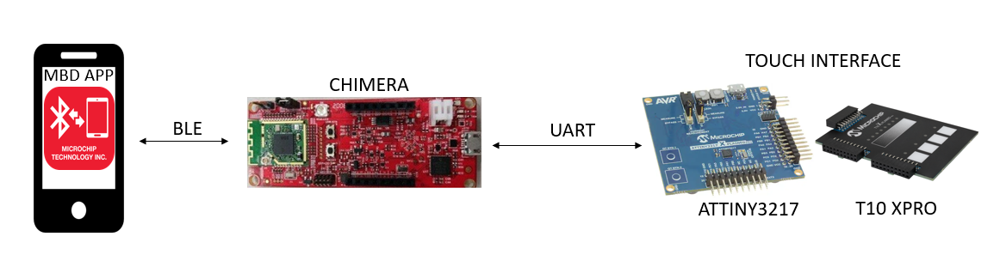
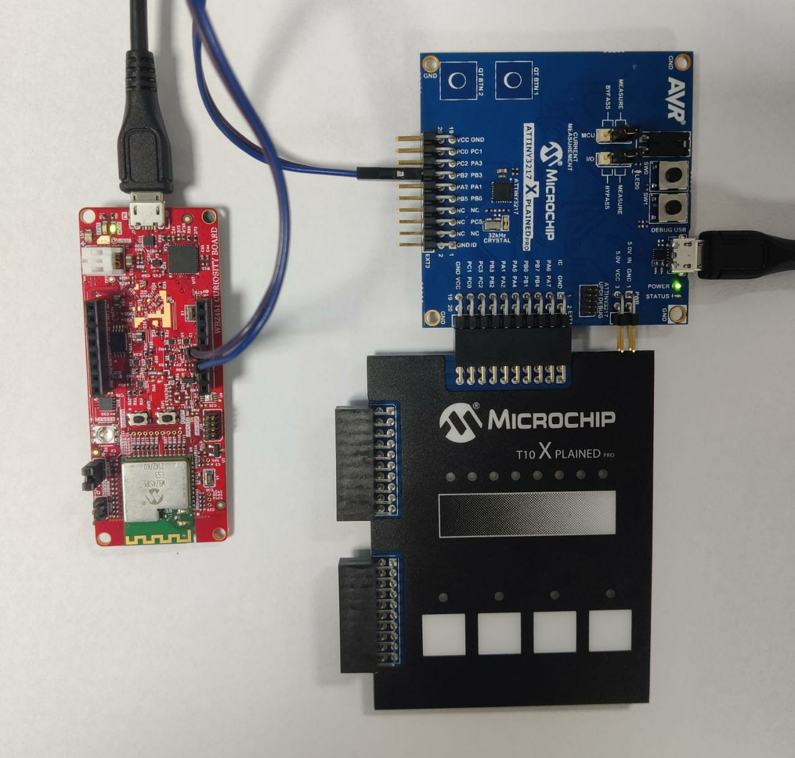
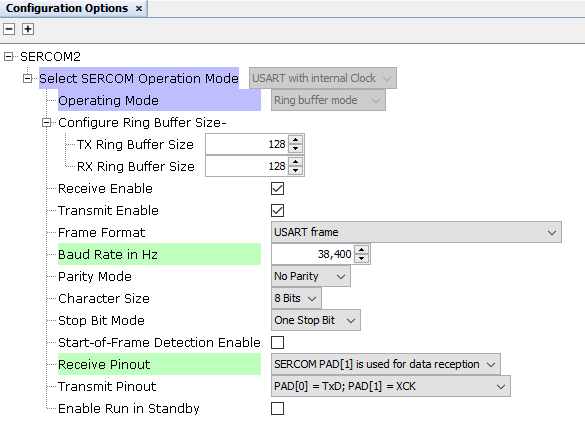
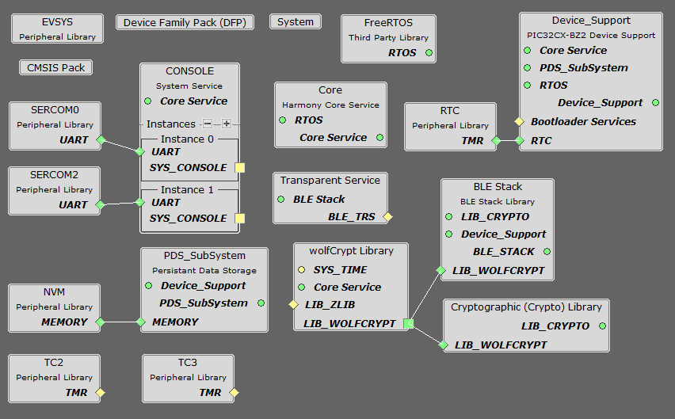
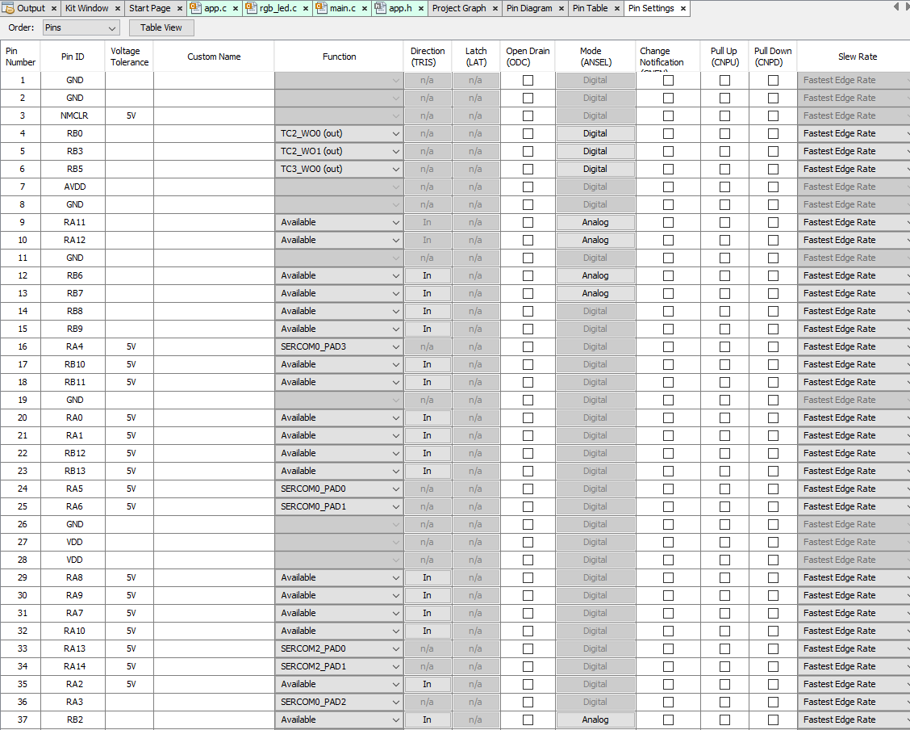
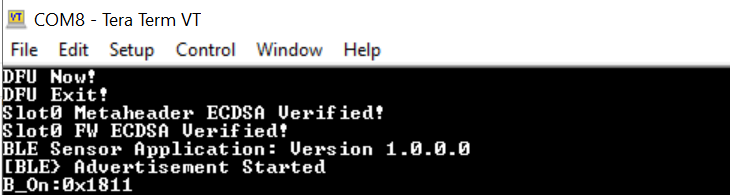

# WBZ45x BLE Sensor with ATTINY3217 Touch Demo

> "Wireless Made Easy!" - This example applications add Wi-Fi connectivity to a BLE+15.4 capable device

Devices: **| PIC32CXBZ2 | WBZ45x | ATtiny3217 Xplained Pro |** 
Features: **| BLE | TOUCH |**

## ⚠ Disclaimer

<b>
THE SOFTWARE ARE PROVIDED "AS IS" AND GIVE A PATH FOR SELF-SUPPORT AND SELF-MAINTENANCE. This repository contains example code intended to help accelerate client product development.  

For additional Microchip repos, see: <a href="https://github.com/Microchip-MPLAB-Harmony" target="_blank">https://github.com/Microchip-MPLAB-Harmony</a>

Checkout the <a href="https://microchipsupport.force.com/s/" target="_blank">Technical support portal</a> to access our knowledge base, community forums or submit support ticket requests.

</b>

## Contents

1. [Introduction](#step1)
1. [Bill of materials](#step2)
1. [Hardware Setup](#step3)
1. [Software Setup](#step4)
1. [Harmony MCC Configuration](#step5)
1. [Atmel Start Configuration](#step6)
1. [Board Programming](#step7)
1. [Run the demo](#step8)

## 1. Introduction<a name="step1">

This application demonstrates the use of an external touch interface(ATtiny3217 Xplained Pro+T10 Xplained Pro kit) through UART protocol and Microchip Bluetooth Data(MBD) app through Bluetooth Low Energy(BLE) to control the RGB led of WBZ451 curiosity board. The WBZ451 device will also report the temperature data periodically to mobile phone through BLE.

The T10 Xplained Pro kit has four mutual capacitance buttons and a mutual capacitance slider. This kit is supported by the ATtiny3217 Xplained Pro as it has a capacitive touch enabled MCU and a matching pinout that connects the external headers. The four mutual capacitance buttons are configured for Red, Green, Blue and ON_OFF button. The intensity of each Red, Green and Blue button is controlled by the slider respectively. The range of one slide is from minimum intensity to medium intensity and the second slide is from medium intensity to maximum intensity and the vice versa to reduce the intensity. To set the maximum intensity of a color we need to complete two full swipes in the slider. This touch data is transmitted to WBZ451 curiosity board through USART protocol in the form of a 32 bit data frame as shown below. 

This data frame is received by the WBZ451 curiosity board and is used to control the RGB led. Whenever the RGB button is pressed the RGB led switches on and when the ON_OFF button is pressed again the led switches off. These changes are also shown in the MBD app.

#### Note
The mutual capacitance slider in T10 Xplained Pro kit has 4 sensors.  Because of this, the slider can only set four intensity values on a single slide. To increase the RGB led's resolution, we are using two slide logic in the application.

## 2. Bill of materials<a name="step2">

- [ATtiny3217 Xplained Pro Xplained Pro](https://www.microchip.com/en-us/development-tool/ATtiny3217 Xplained Pro-XPRO)
- [T10 Xplained Pro Extension Kit](https://www.microchip.com/en-us/development-tool/AC47H23A)
- [PIC32CXBZ2-WBZ451-EA Curiosity Board](https://www.microchip.com/en-us/development-tool/EA71C53A)

## 3. Hardware Setup<a name="step3">

- Connect T10 Extension header 3 (EXT3) to ATtiny3217 Xplained Pro Xplained Pro kit Extension Header 1 (EXT1).
- Connect the External 3 header of ATtiny3217 Xplained Pro touch interface with the WBZ451 CURIOSITY BOARD using jumper wires as shown in the table below.

|ATtiny3217 Xplained Pro+T10|Description|WBZ451 PIN Name\Number|Description|
| :- | :- | :- | :- |
|PB3|UART-RX|PA13|Sercom2-USART-TX|
|PB2|UART-TX|PA14|Sercom2-USART-RX|

## 4. Software Setup<a name="step4">

- [Microchip Studio](https://www.microchip.com/en-us/tools-resources/develop/microchip-studio#Downloads)

	- Version: 7.0.2594
	- XC8Toolchain Provider(1.0.140)
	- Atmel kits(7.0.132)
	
- [MPLAB X IDE ](https://www.microchip.com/en-us/tools-resources/develop/mplab-x-ide#tabs)

    - Version: 6.00
	- XC32 Compiler v4.10
	- MPLAB® Code Configurator v5.1.17
	- PIC32CX-BZ_DFP v1.0.107
	- MCC Harmony
	  - csp version: v3.13.1
	  - core version: v3.11.1
	  - CMSIS-FreeRTOS: V10.3.1
	  - zlib version: v1.2.11
	  - dev_packs: v3.13.0
	  - wolfssl version: v4.7.0
	  - crypto version: v3.7.6

- Any Serial Terminal application like [TERA TERM](https://download.cnet.com/Tera-Term/3000-2094_4-75766675.html) terminal application

- [Microchip Bluetooth Data (MBD) iOS/Android app](https://play.google.com/store/apps/details?id=com.microchip.bluetooth.data&hl=en_IN&gl=US)

- [MPLAB X IPE](https://microchipdeveloper.com/ipe:installation)

## 5. Harmony MCC Configuration<a name="step5">

### Getting started with touch application in WBZ451 Curiosity board

**Step 1** - Connect the WBZ451 CURIOSITY BOARD and touch interface to the device/system using a micro-USB cable.

**Step 2** - Create a new MCC harmony project in MPLAB X IDE.

**Step 3** - Follow the steps provided in the [BLE Sensor App Configurations](https://github.com/MicrochipTech/EA71C53A/tree/master/H3/wireless_apps_pic32cxbz2_wbz45/apps/ble/advanced_applications/ble_sensor_app#-headmplabx-harmony-provides-the-mplab-code-configurator-mcc-tool-a-set-of-modular-device-and-middleware-libraries-and-numerous-example-applications-all-of-which-are-designed-to-help-developers-to-quickly-and-easily-develop-powerful-and-efficient-embedded-software-the-following-steps-can-be-followed-to-open-mcc-tool-and-generate-the-code) to create the project graph.

**Step 4** - In addition, add and configure SERCOM2 as shown below.

**Step 5** - Connect SERCOM2 as second instance to the SYSTEM CONSOLE as shown.

**Step 6** - In project graph, go to Plugins->Pin configurations->Pin settings and set the pin configuration as shown below.

**Step 7** - Click the "Generate" button.

**Step 8** - In "app_user_edits.c", make sure this line is commented "#error User action required - manually edit files as described here".

**Step 9** - Remove the generated "app.c" and "app.h" file. Add the "app.c" and "rgb_led.c" files given in the folder under source files and "app.h" and "rgb_led.h" files given in the folder under header files in your project by following the steps mentioned below.

#### To remove files

- Right click on the file in projects
- Select "Remove from project".

#### To add files

- Copy the files to the "src" folder.
- In MPLAB, right click on the file under which you would want to add the file to your project.
- Select Add Existing item.
- Select the file and click add.

#### Note
The "rgb_led.c" and "rgb_led.h" can be found by navigating to the following path: "PIC32CXBZ2_WBZ45x_BLE_SENSOR_Touch_ATtiny3217 Xplained Pro/WBZ451_ATtiny3217 Xplained Pro/firmware/src/sensors" and "app.c" and "app.h" can be found by navigating to the following path: "PIC32CXBZ2_WBZ45x_BLE_SENSOR_Touch_ATtiny3217 Xplained Pro/WBZ451_ATtiny3217 Xplained Pro/firmware/src".

**Step 10** - Clean and build the project.To run the project select "Make and program device" button.

**Step 11** - To the test the application in MBD app follow the steps in the [BLE Sensor App](https://github.com/MicrochipTech/EA71C53A/tree/master/H3/wireless_apps_pic32cxbz2_wbz45/apps/ble/advanced_applications/ble_sensor_app#expected-out-of-box-behavior).

**Step 12** - The received data is printed onto the tera term as shown below.

- Baud rate: 115200
- Com port: COM8 USB serial port

#### Note
This application's folder can be found by navigating to the following path: "PIC32CXBZ2_WBZ45x_BLE_SENSOR_Touch_ATtiny3217 Xplained Pro/ble_sensor_touch/firmware/ble_sensor_touch.X".

## 6. Atmel Start Configuration<a name="step6">

- Follow the steps provided to [program the precompiled hex file](https://microchipdeveloper.com/ipe:programming-device) to program the ATtiny3217 Xplained Pro.
- To create the Atmel Start project from scratch follow steps in this [link]()

## 7. Board Programming<a name="step7">

### Program the precompiled hex file using MPLAB X IPE

- Follow the steps in the link to [program the precompiled hex file](https://microchipdeveloper.com/ipe:programming-device) using MPLABX IPE to program the pre-compiled hex image. 

#### Note
The application hex files can be found by navigating to the following paths: "PIC32CXBZ2_WBZ45x_BLE_SENSOR_Touch_ATtiny3217 Xplained Pro/hex/ble_sensor_touch.X.production.signed.unified.hex" and "PIC32CXBZ2_WBZ45x_BLE_SENSOR_Touch_ATtiny3217 Xplained Pro/hex/ATtiny3217 Xplained Pro_T10.hex"

### Build and program the application using MPLAB X IDE

- Follow the steps in the link to [Build and program the application](https://github.com/MicrochipTech/EA71C53A/blob/master/H3/wireless_apps_pic32cxbz2_wbz45/apps/ble/advanced_applications/ble_sensor_app/readme.md#build-and-program-the-application).

#### Note
The application folders can be found by navigating to the following paths: "PIC32CXBZ2_WBZ45x_BLE_SENSOR_Touch_ATtiny3217 Xplained Pro/ble_sensor_ATtiny3217 Xplained Pro_touch/firmware/ble_sensor_touch.X" and "PIC32CXBZ2_WBZ45x_BLE_SENSOR_Touch_ATtiny3217 Xplained Pro/ATtiny3217 Xplained Pro_T10"

## 8. Run the demo<a name="step8">

- After programming the board the expected application behavior as shown in the below [video](https://github.com/MicrochipTech/PIC32CXBZ2_WBZ45x_BLE_SENSOR_Touch_ATtiny3217 Xplained Pro/blob/main/docs/Working_Demo.gif).

