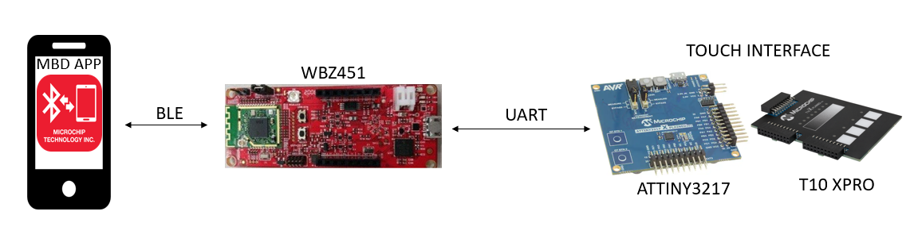
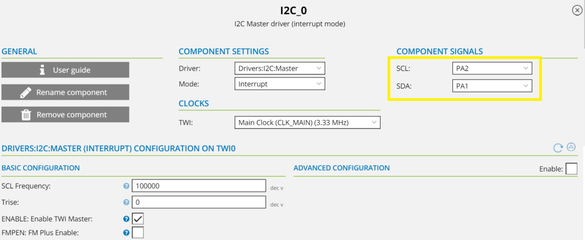
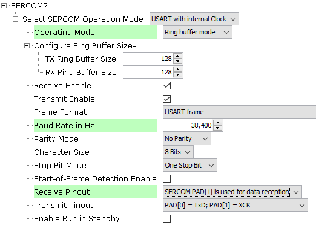

# WBZ451 CURIOSITY BOARD AND TOUCH WITH BLE

## Application to control the RGB led on WBZ451 Curiosity board using T10 Board and Microchip Bluetooth Data(MBD) iOS/Android app.

This package has the supporting documentation to get started with touch application using T10 xpro with ATTINY3217 XPRO Board to control the RGB led on WBZ451 Curiosity board and simultaneously control and update the RGB led through Microchip Bluetooth Data(MBD) iOS/Android app using [BLE Sensor application](https://github.com/MicrochipTech/EA71C53A/tree/master/H3/wireless_apps_pic32cxbz2_wbz45/apps/ble/advanced_applications/ble_sensor_app).

## ⚠ Disclaimer

<b>
THE SOFTWARE ARE PROVIDED "AS IS" AND GIVE A PATH FOR SELF-SUPPORT AND SELF-MAINTENANCE. This repository contains example code intended to help accelerate client product development.  

For additional Microchip repos, see: <a href="https://github.com/Microchip-MPLAB-Harmony" target="_blank">https://github.com/Microchip-MPLAB-Harmony</a>

Checkout the <a href="https://microchipsupport.force.com/s/" target="_blank">Technical support portal</a> to access our knowledge base, community forums or submit support ticket requests.

</b>

## Contents

1. [Introduction](#step1)
1. [Bill of materials](#step2)
1. [Hardware Setup](#step3)
1. [Software Setup](#step4)
1. [Atmel Start Configuration](#step5)
1. [Harmony MCC Configuration](#step6)
1. [Board Programming](#step7)
1. [Run the demo](#step8)

## 1. Introduction<a name="step1">

This application demonstrates the use of an external touch interface(ATTINY3217+T10 XPRO) to control the RGB led of WBZ451 curiosity board using UART communication and the capability of WBZ451 module to connect to a mobile phone through Bluetooth Low Energy(BLE). The RGB LED on the Curiosity board can be controlled by mobile app. The WBZ451 device will also report the temperature data periodically to mobile phone through Bluetooth low energy (BLE).

The touch board, T10 Xpro, has 4 mutual capacitance buttons and a mutual capacitance slider. This kit is supported by ATTINY 3217 Xplained Pro as it has a capacitive touch enabled MCU and a matching pinout that connects the external headers.The four mutual capacitance buttons are configured for Red, Green, Blue and ON_OFF button. The intensity of each Red, Green and Blue button is controlled by the slider respectively. The range of one slide is from minimum to mid range and the second slide is from mid range to maximum and the vice versa to reduce the intensity. So to set the maximum intensity of a color we need to complete two full swipes in the slider. This touch data is transmitted to WBZ451 curiosity board through USART in the form of a 32 bit data frame as shown below. 

This data frame is received by the WBZ451 curiosity board and it is used to control the RGB led. Whenever the RGB button is pressed the RGB led switches ON and when the ON_OFF button is pressed again the led switches off. This changes is also shown in the MBD app.

#### Note
The mutual capacitance slider in T10 xpro has only 4 sensors.  Because of this, the slider can only set four intensity values on a single slide. To increase the RGB led's resolution, we are using two slide logic in the application.

## 2. Bill of materials<a name="step2">

- [ATtiny3217 Xplained Pro](https://www.microchip.com/en-us/development-tool/ATTINY3217-XPRO)
- [T10 Xplained Pro Extension Kit](https://www.microchip.com/en-us/development-tool/AC47H23A)
- [PIC32CXBZ2-WBZ451-EA Curiosity Board](https://www.microchip.com/en-us/development-tool/EA71C53A)

## 3. Hardware Setup<a name="step3">

- Connect T10 Extension header 3 (EXT3) to ATtiny3217 Xplained Pro kit Extension Header 1 (EXT1).
- Connect the External 3 header of ATtiny3217 touch interface with the WBZ451 CURIOSITY BOARD using jumper wires as shown in the table below.

|ATTINY3217+T10|Description|WBZ451 PIN Name\Number|Description|
| :- | :- | :- | :- |
|PB3|UART-RX|PA13|Sercom2-USART-TX|
|PB2|UART-TX|PA14|Sercom2-USART-RX|

## 4. Software Setup<a name="step4">

- [Microchip Studio](https://www.microchip.com/en-us/tools-resources/develop/microchip-studio#Downloads)

- [MPLAB X IDE](https://www.microchip.com/en-us/tools-resources/develop/mplab-x-ide#tabs)

	- XC32 Compiler v4.10
	- MPLAB® Code Configurator v5.1.17
	- PIC32CX-BZ_DFP v1.0.107
	- MCC Harmony
	  - csp version: v3.13.1
	  - core version: v3.11.1
	  - CMSIS-FreeRTOS: V10.3.1
	  - zlib version: v1.2.11
	  - dev_packs: v3.13.0
	  - wolfssl version: v4.7.0
	  - crypto version: v3.7.6

- [TERA TERM](https://download.cnet.com/Tera-Term/3000-2094_4-75766675.html)

- [Microchip Bluetooth Data (MBD) iOS/Android app](https://play.google.com/store/apps/details?id=com.microchip.bluetooth.data&hl=en_IN&gl=US)

- [MPLAB X IPE](https://microchipdeveloper.com/ipe:installation)

## 5. Atmel Start Configuration<a name="step5">

### Getting started with touch application in ATTINY3217 XPRO

**Step 1** - Connect the ATtiny3217 and T10 xpro interface to the device/system using a micro-USB cable.

**Step 2** - Create a new Atmel start project on Microchip Studio.

**Step 3** - From the middleware section add QTouch Library.

**Step 4** - From the drivers section add the following peripheral modules

- I2C
- Timer
- PTC
- USART

**Step 5** - Select ATtiny 3217 Xplained Pro board and then select create new project.

**Step 6** - Change the USART configurations as shown below.

**Step 7** - Change the I2C configurations as shown below.

**Step 8** - In the QTouch configurator select the sensor and pin configurations for button and slider as shown below.

- Pin configuration

**Step 9** - Select generate project button.

**Step 10** - In the solution explorer you will find the generated project.

**Step 11** - Add the "main.c", "led_driver.c" and "led_driver.h" files to your project by following the steps mentioned below.

- Copy the files to the "src" folder.
- Right click on the project in Solution explorer.
- Select Add->Existing item.
- Select the file and click add.

**Step 12** - In the projects section, go to touch.h and change the DEF_TOUCH_DATA_STREAMER_ENABLE value to 0u.

- #define DEF_TOUCH_DATA_STREAMER_ENABLE 0u

**Step 13** - Run the application. The logic implemented in ATtiny3217 is shown in the video below.

**Step 14** - The transmitted data can be seen in the Tools->Data Visualizer or in Tera term by making the follwing settings.
- Baud rate: 38400
- Com port: EDBG virtual COM port

#### Application Flowchart

The below video shows the working of the slider logic implemented in this application.

#### Note
This application's folder can be found by navigating to the following path: "WBZ451_TOUCH/ATTINY3217_T10"

## 6. Harmony MCC Configuration<a name="step6">

### Getting started with touch application in WBZ451 Curiosity board

**Step 1** - Connect the WBZ451 CURIOSITY BOARD and touch interface to the device/system using a micro-USB cable.

**Step 2** - Create a new MCC harmony project in MPLAB X IDE.

**Step 3** - Follow the steps provided in the [BLE Sensor App Configurations](https://github.com/MicrochipTech/EA71C53A/tree/master/H3/wireless_apps_pic32cxbz2_wbz45/apps/ble/advanced_applications/ble_sensor_app#-headmplabx-harmony-provides-the-mplab-code-configurator-mcc-tool-a-set-of-modular-device-and-middleware-libraries-and-numerous-example-applications-all-of-which-are-designed-to-help-developers-to-quickly-and-easily-develop-powerful-and-efficient-embedded-software-the-following-steps-can-be-followed-to-open-mcc-tool-and-generate-the-code) to create the project graph.

**Step 4** - In addition, add and configure SERCOM2 as shown below and connect it as second instance to the SYSTEM CONSOLE.

**Step 5** - Make the connections as shown below

**Step 6** - In project graph, go to Plugins->Pin configurations->Pin settings and set the pin configuration as shown below.

**Step 7** - Click the "Generate" button.

**Step 8** - In "app_user_edits.c", make sure this line is commented "#error User action required - manually edit files as described here".

**Step 9** - Remove the generated "app.c" and "app.h" file. Add the "app.c" and "rgb_led.c" files given in the folder under source files and "app.h" and "rgb_led.h" files given in the folder under header files in your project by following the steps mentioned below.

#### To remove files

- Right click on the file in projects
- Select "Remove from project".

#### To add files

- Copy the files to the "src" folder.
- In MPLAB, right click on the file under which you would want to add the file to your project.
- Select Add Existing item.
- Select the file and click add.

#### Note
The "rgb_led.c" and "rgb_led.h" can be found by navigating to the following path: "WBZ451_TOUCH/WBZ451_ATTINY3217/firmware/src/sensors" and "app.c" and "app.h" can be found by navigating to the following path: "WBZ451_TOUCH/WBZ451_ATTINY3217/firmware/src".

**Step 10** - Clean and build the project.To run the project select "Make and program device" button.

**Step 11** - To the test the application in MBD app follow the steps in the [BLE Sensor App](https://github.com/MicrochipTech/EA71C53A/tree/master/H3/wireless_apps_pic32cxbz2_wbz45/apps/ble/advanced_applications/ble_sensor_app#expected-out-of-box-behavior).

**Step 12** - The received data is printed onto the tera term as shown below.

- Baud rate: 115200
- Com port: COM8 USB serial port

#### Note
This application's folder can be found by navigating to the following path: "WBZ451_TOUCH/ble_sensor_touch/firmware/ble_sensor_touch.X".

## 7. Board Programming<a name="step7">

### Program the precompiled hex file using MPLAB X IPE

- Follow the steps in the link to [Program the precompiled hex file](https://microchipdeveloper.com/ipe:programming-device) using MPLABX IPE to program the pre-compiled hex image. 

#### Note
The application hex files can be found by navigating to the following paths: "WBZ451_TOUCH/hex/ble_sensor_touch.X.production.signed.unified.hex" and "WBZ451_TOUCH/hex/ATTINY3217_T10.hex"

### Build and program the application using MPLAB X IDE

- Follow the steps in the link to [Build and program the application](https://github.com/MicrochipTech/EA71C53A/blob/master/H3/wireless_apps_pic32cxbz2_wbz45/apps/ble/advanced_applications/ble_sensor_app/readme.md#build-and-program-the-application).

#### Note
The application folders can be found by navigating to the following paths: "WBZ451_TOUCH/ble_sensor_attiny3217_touch/firmware/ble_sensor_touch.X" and "WBZ451_TOUCH/ATTINY3217_T10"

## 8. Run the demo<a name="step8">

- After programming the board the expected application behavior is shown in the video below.

