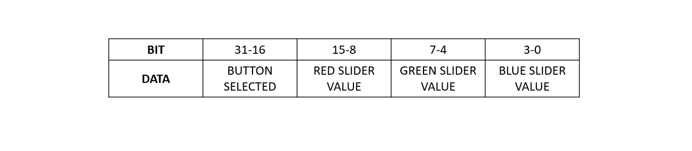
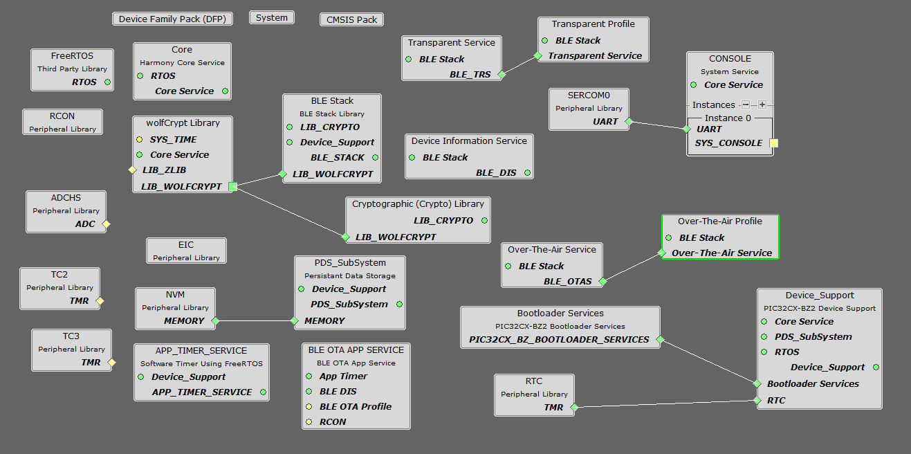
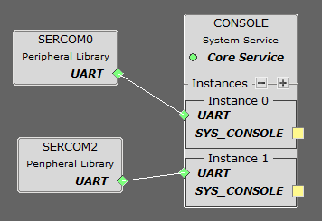
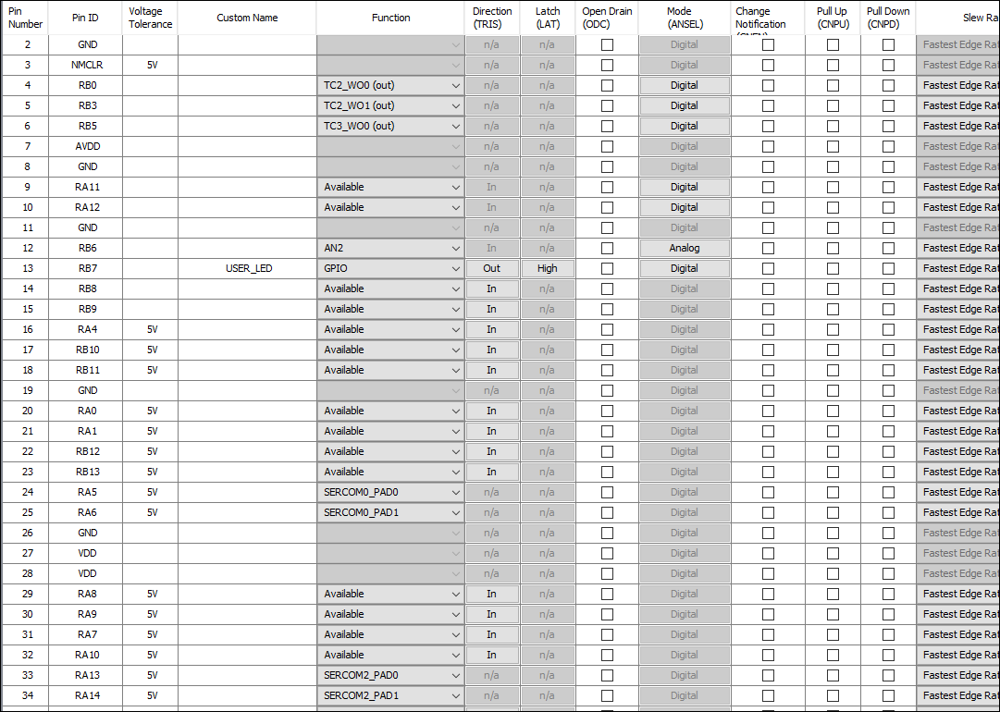
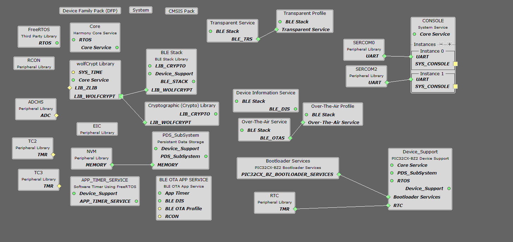

# WBZ45x BLE Sensor with ATTINY3217 Touch Demo

> "Wireless Made Easy!" 

Devices: **| PIC32CXBZ2 | WBZ45x | ATtiny3217 Xplained Pro |** 
Features: **| BLE | TOUCH |**

## ⚠ Disclaimer

<b>
THE SOFTWARE ARE PROVIDED "AS IS" AND GIVE A PATH FOR SELF-SUPPORT AND SELF-MAINTENANCE. This repository contains example code intended to help accelerate client product development.  

For additional Microchip repos, see: <a href="https://github.com/Microchip-MPLAB-Harmony" target="_blank">https://github.com/Microchip-MPLAB-Harmony</a>

Checkout the <a href="https://microchipsupport.force.com/s/" target="_blank">Technical support portal</a> to access our knowledge base, community forums or submit support ticket requests.

</b>

## Contents

1. [Introduction](#step1)
1. [Bill of materials](#step2)
1. [Hardware Setup](#step3)
1. [Software Setup](#step4)
1. [Harmony MCC Configuration](#step5)
1. [ATtiny3217 Touch Application Code](#step6)
1. [Board Programming](#step7)
1. [Run the demo](#step8)

## 1. Introduction<a name="step1">

This application demonstrates the use of an external touch interface (ATtiny3217 Xplained Pro and T10 Xplained Pro kit) through UART protocol to control the RGB LED of WBZ451 Curiosity board. The LED can also be controlled by Microchip Bluetooth Data (MBD) application through Bluetooth Low Energy (BLE) using [BLE Sensor application](https://github.com/Microchip-MPLAB-Harmony/wireless_apps_pic32cxbz2_wbz45/tree/master/apps/ble/advanced_applications/ble_sensor). The WBZ451 Curiosity board will report the LED status to mobile phone and touch interface through BLE and UART respectively. The temperature data is also periodically reported to the mobile phone through BLE.

The T10 Xplained Pro kit has four mutual capacitance buttons and one mutual capacitance slider. This kit is supported by the ATtiny3217 Xplained Pro as it has a capacitive touch enabled MCU and a matching pinout that connects the external headers. The four mutual capacitance buttons are configured for Red, Green, Blue and ON_OFF button. The intensity of each Red, Green and Blue button is controlled by the slider respectively. 

To set maximum intensity of a color in the LED we need to complete two full swipes in the slider. The range of one slide is from minimum intensity to medium intensity and the second slide is from medium intensity to maximum intensity and the vice versa to reduce the intensity. This touch data is transmitted to WBZ451 Curiosity board through UART protocol in the form of a 32-bit data frame as shown below. 

The WBZ451 curiosity board receives this data frame and uses this to control the RGB LED. Whenever the RGB button is pressed the LED switches on and when the ON_OFF button is pressed the LED switches off. These changes are also reflected in the MBD application.

#### Note
The mutual capacitance slider in T10 Xplained Pro kit has 4 sensors.  Because of this, the slider can only set four intensity values on a single slide. To increase the RGB LED's resolution, we are using two slide logic in the application.

## 2. Bill of materials<a name="step2">

- [ATtiny3217 Xplained Pro](https://www.microchip.com/en-us/development-tool/ATTINY3217-XPRO)
- [T10 Xplained Pro Extension Kit](https://www.microchip.com/en-us/development-tool/AC47H23A)
- [PIC32CXBZ2-WBZ451-EA Curiosity Board](https://www.microchip.com/en-us/development-tool/EA71C53A)

## 3. Hardware Setup<a name="step3">

- Connect T10 Extension header 3 (EXT3) to ATtiny3217 Xplained Pro  Extension Header 1 (EXT1).
- Connect the External 3 header of ATtiny3217 Xplained Pro touch interface with the WBZ451 Curiosity board using jumper wires as shown in the table below.

|ATtiny3217 Xplained Pro+T10 Xplained Pro|Description|WBZ451 Curiosity board PIN Name\Number|Description|
| :- | :- | :- | :- |
|PB3|UART-RX|PA13|Sercom2-UART-TX|
|PB2|UART-TX|PA14|Sercom2-UART-RX|

## 4. Software Setup<a name="step4">

- [Microchip Studio](https://www.microchip.com/en-us/tools-resources/develop/microchip-studio#Downloads)

	- Version: 7.0.2594
	- XC8Toolchain Provider (1.0.140)
	- Atmel kits (7.0.132)
	
- [MPLAB X IDE ](https://www.microchip.com/en-us/tools-resources/develop/mplab-x-ide#tabs)

    - Version: 6.00
	- XC32 Compiler v4.10
	- MPLAB® Code Configurator v5.1.17
	- PIC32CX-BZ_DFP v1.0.107
	- MCC Harmony
	  - csp version: v3.13.1
	  - core version: v3.11.1
	  - CMSIS-FreeRTOS: V10.3.1
	  - zlib version: v1.2.11
	  - dev_packs: v3.13.0
	  - wolfssl version: v4.7.0
	  - crypto version: v3.7.6
	  - wireless_pic32cxbz_wbz: v1.0.0
	  - wireless_ble: v1.0.0
	  - wireless_system_pic32cxbz_wbz: v1.0.0

- Any Serial Terminal application like [TERA TERM](https://download.cnet.com/Tera-Term/3000-2094_4-75766675.html) terminal application

- [Microchip Bluetooth Data (MBD) iOS/Android app](https://play.google.com/store/apps/details?id=com.microchip.bluetooth.data&hl=en_IN&gl=US)

- [MPLAB X IPE v6.00](https://microchipdeveloper.com/ipe:installation)

## 5. Harmony MCC Configuration<a name="step5">

### Getting started with touch application in WBZ451 Curiosity board Curiosity board

| Tip | New users of MPLAB Code Configurator are recommended to go through the [overview](https://onlinedocs.microchip.com/pr/GUID-1F7007B8-9A46-4D03-AEED-650357BA760D-en-US-6/index.html?GUID-AFAB9227-B10C-4FAE-9785-98474664B50A) |
| :- | :- |

**Step 1** - Connect the WBZ451 CURIOSITY BOARD and touch interface to the device/system using a micro-USB cable.

**Step 2** - This application is built by using [BLE Sensor Application](https://github.com/Microchip-MPLAB-Harmony/wireless_apps_pic32cxbz2_wbz45/tree/master/apps/ble/advanced_applications/ble_sensor) as the building block. The project graph of the BLE Sensor application is shown below.

| Note | The BLE Sensor application repository can be cloned/downloaded from this [link](https://github.com/Microchip-MPLAB-Harmony/wireless_apps_pic32cxbz2_wbz45). |
| :- | :- |
| File path | wireless_apps_pic32cxbz2_wbz45/apps/ble/advanced_applications/ble_sensor/ firmware/ ble_sensor.x |

**Step 4** - In MCC harmony project graph select the SERCOM2 from device resources->peripherals and configure as shown below.

**Step 5** - In MCC harmony project graph, select System Console and configure as mentioned below.

- Add another instance by clicking the "+" button in System Console device and connect SERCOM2 to Instance 1.

**Step 6** - Make the system configurations as shown below.

**Step 7** - In project graph, go to Plugins->Pin configurations->Pin settings and set the pin configuration as shown below.

**Step 8** - The project graph after making the configurations is shown below.

**Step 9** - [Generate the code](https://onlinedocs.microchip.com/pr/GUID-A5330D3A-9F51-4A26-B71D-8503A493DF9C-en-US-1/index.html?GUID-9C28F407-4879-4174-9963-2CF34161398E).

**Step 10** - In "app_user_edits.c", make sure the below code line is commented 

- "#error User action required - manually edit files as described here".

**Step 11** - Copy the mentioned files from this repository by navigating to the location mentiond below and replace the generated files. 

| Note | This application repository should be cloned/downloaded to perform the following steps. |
| :- | :- |

- Copy the "app.c","app_ble_sensor.c","app_ble_sensor.h" and "app.h" files, which can be found by navigating to the following path: "PIC32CXBZ2_WBZ45x_BLE_SENSOR_Touch_ATtiny3217\ble_sensor_attiny3217_touch\firmware\src".
- Replace the "app.c","app_ble_sensor.c","app.h" and "app_ble_sensor.h" files in your project folder location(...\wireless_apps_pic32cxbz2_wbz45\apps\ble\advanced_applications\ble_sensor\firmware\src).
- Copy the "app_ble.c","app_ble.h","app_ble_handler.c" and "app_ble_handler.h" files, which can be found by navigating to the following path: "PIC32CXBZ2_WBZ45x_BLE_SENSOR_Touch_ATtiny3217\ble_sensor_attiny3217_touch\firmware\src\app_ble".
- Replace the "app_ble.c","app_ble.h","app_ble_handler.c" and "app_ble_handler.h" files in your project folder location(...\wireless_apps_pic32cxbz2_wbz45\apps\ble\advanced_applications\ble_sensor\firmware\src\app_ble).
- Copy the "Sensors" folder which can be found by navigating to the following path: "PIC32CXBZ2_WBZ45x_BLE_SENSOR_Touch_ATtiny3217\ble_sensor_attiny3217_touch\firmware\src".
- Replace the "Sensors" folder in your project folder location(...\wireless_apps_pic32cxbz2_wbz45\apps\ble\advanced_applications\ble_sensor\firmware\src).

**Step 12** - Clean and build the project. To run the project, select "Make and program device" button.

**Step 13** - To the test the application in MBD app follow the steps provided in the [BLE Sensor App](https://github.com/Microchip-MPLAB-Harmony/wireless_apps_pic32cxbz2_wbz45/tree/master/apps/ble/advanced_applications/ble_sensor#expected-out-of-box-behavior-guid-55c9fa3e-cc06-46c9-8a62-327fff7b44ab-section).

**Step 14** - The data printed onto the tera term is shown below.

- Baud rate: 115200
- Com port: COM USB serial port

## 6. ATtiny3217 Touch Application <a name="step6">

- Follow the steps provided under [program the precompiled hex file](https://github.com/MicrochipTech/PIC32CXBZ2_WBZ45x_BLE_SENSOR_Touch_ATtiny3217#7-board-programming) section to program the ATtiny3217 Xplained Pro and T10 Xplained Pro interface.
- To create the Atmel Start project from scratch follow steps provided in this [link](https://github.com/MicrochipTech/PIC32CXBZ2_WBZ45x_BLE_SENSOR_Touch_ATtiny3217/tree/main/ATTiny3217_T10#wbz45x-ble-sensor-with-attiny3217-touch-demo).

## 7. Board Programming<a name="step7">

### Program the precompiled hex file using MPLAB X IPE

The application hex files can be found by navigating to the following paths: 
- "PIC32CXBZ2_WBZ45x_BLE_SENSOR_Touch_ATtiny3217/hex/ble_sensor_touch.X.production.signed.unified.hex"
- "PIC32CXBZ2_WBZ45x_BLE_SENSOR_Touch_ATtiny3217/hex/ATTiny3217_T10.hex"

Follow the steps provided in the link to [program the precompiled hex file](https://microchipdeveloper.com/ipe:programming-device) using MPLABX IPE to program the pre-compiled hex image. 

### Build and program the application using MPLAB X IDE

The application folder can be found by navigating to the following path: 
- "PIC32CXBZ2_WBZ45x_BLE_SENSOR_Touch_ATtiny3217/ble_sensor_ATtiny3217 Xplained Pro_touch/firmware/ble_sensor_touch.X"

Follow the steps provided in the link to [Build and program the application](https://github.com/Microchip-MPLAB-Harmony/wireless_apps_pic32cxbz2_wbz45/tree/master/apps/ble/advanced_applications/ble_sensor#build-and-program-the-application-guid-3d55fb8a-5995-439d-bcd6-deae7e8e78ad-section).

## 8. Run the demo<a name="step8">

- After programming the board, the expected application behavior is shown in the below [video](https://github.com/MicrochipTech/PIC32CXBZ2_WBZ45x_BLE_SENSOR_Touch_ATtiny3217/blob/main/docs/Working_Demo.gif).

